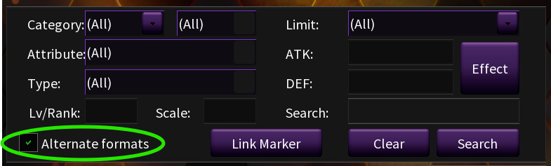
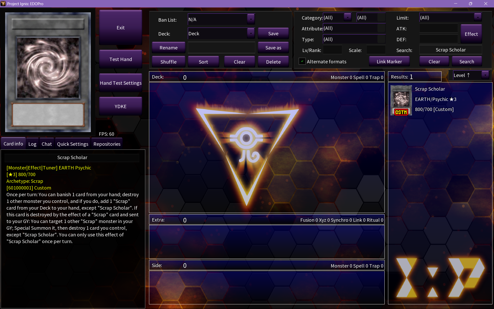
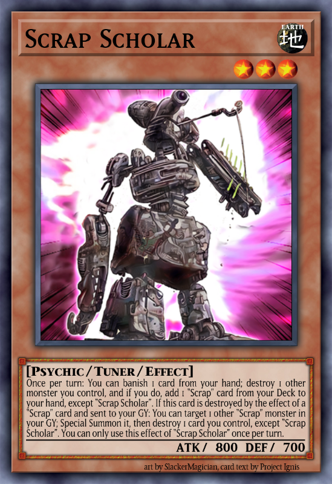
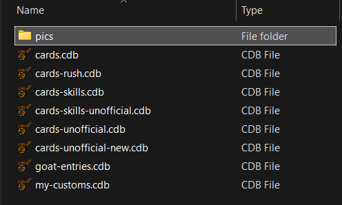
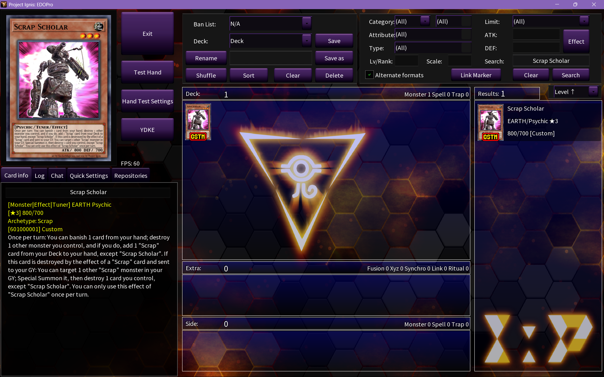
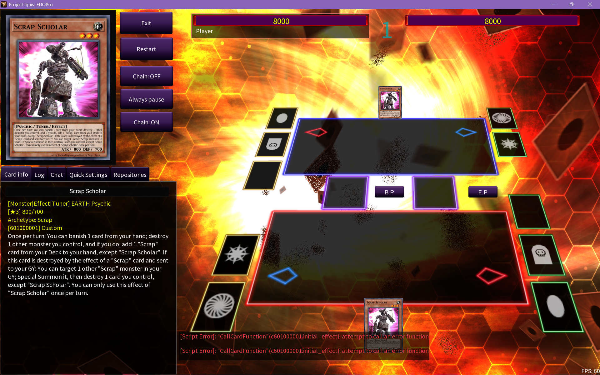

## Loading the card

After you've entered "Scrap Scholar" into the database, _EDOPro_ should be able to load it. Launch your _EDOPro_ and proceed to the Deck Editor.

Since the card is a custom card, you'll need to enable `Alternate formats` to see it:

Typing "Scrap Scholar" on the search box should now display the card:

From here, you can verify if the all of the card's information is correct. If you see anything incorrect, review the [card entry section](#adding-the-card-entry) and double-check your inputs.

::: warning Restart _EDOPro_ whenever you add or edit a card in a database

Card databases are only loaded when _EDOPro_ starts. If you had the program open before adding "Scrap Scholar", the card won't appear until you restart.

The same is true for any changes you make to the database. You need to restart _EDOPro_ for them to apply.

:::

## Adding the card image

Since we haven't added an image for the card, _EDOPro_ simply displays a default placeholder image. The card will work even without an image, so this step is **optional**. However, images help users identify cards from a glance, and it's a lot less satisfying to play with cards with placeholder images.

For "Scrap Scholar", we'll use the following image:

  

You can download the image by right-clicking it and selecting `Save Image As...`. When saving the file, change its name to `601000001.png` (or whatever passcode you chose for the card, followed by the `.png` extension).

To add the image, navigate to your `expansions` folder, and look for a folder named `pics`. If there isn't one, **create it**.

Place the image file (`601000001.png`) inside the `pics` folder, then restart _EDOPro_. It should now display the image for the card:

## The final component

Once the card is loaded into _EDOPro_, it can be added to decks and even be included in duels. However, if you try to start a duel with the "Scrap Scholar" you just added, you'll get an error (the quickest way to test this is putting it in a deck then clicking `Test Hand`):

The error means the simulator attempted to load the card's script but failed. You could Normal Summon the card, but you wouldn't be able to use any of its effects.

This can happen for different reasons, but in this case, we know it happens because we haven't added a script for the card yet. In the next step, we'll create the card's script and start implementing the card's effects.
