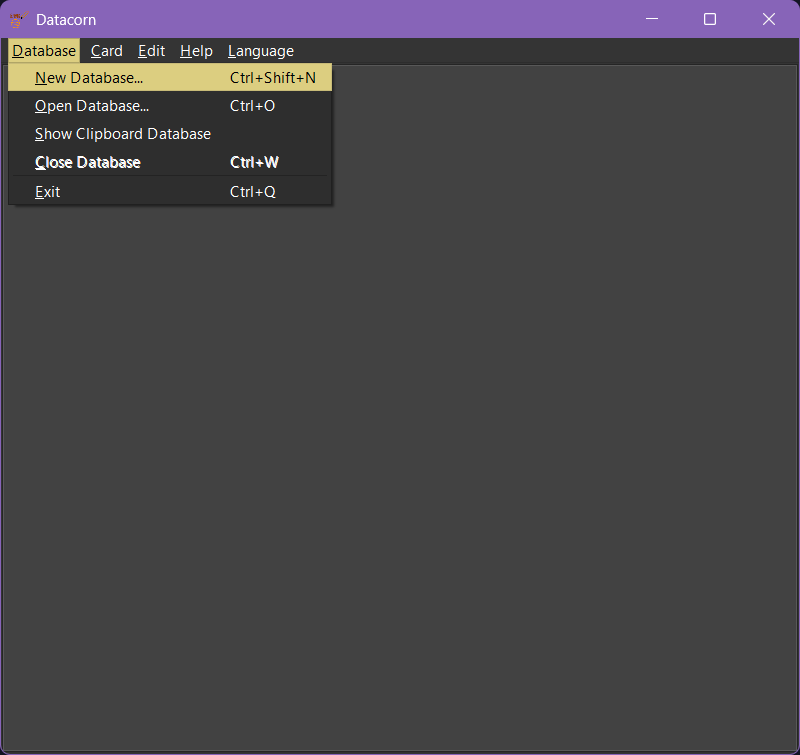
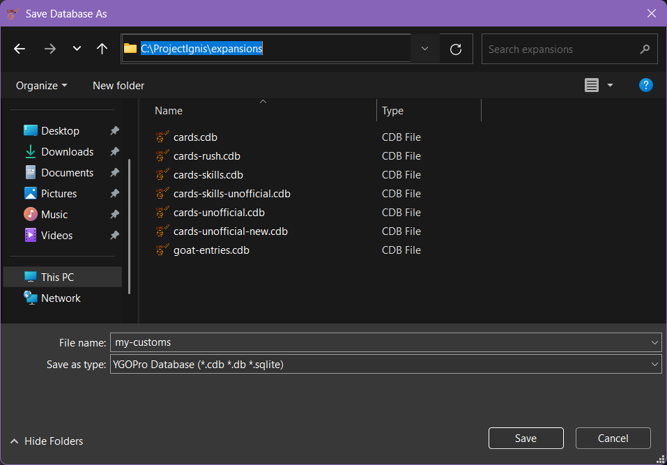
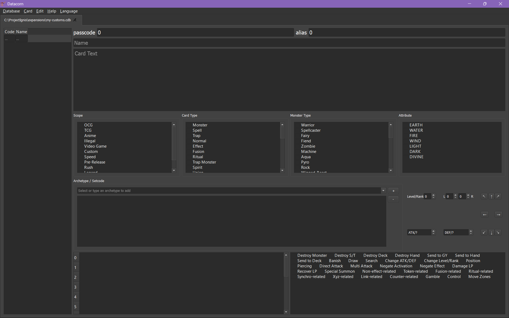
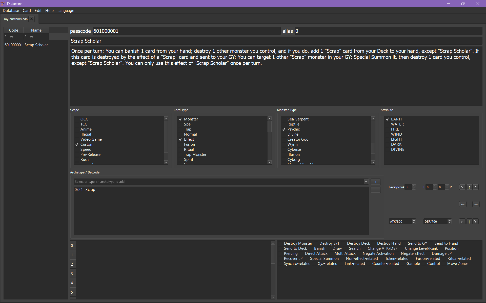
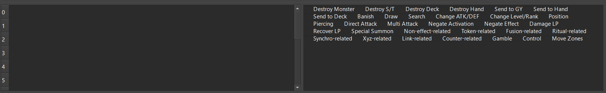
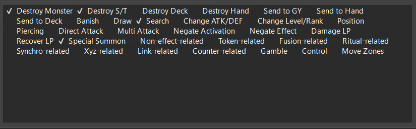

This page explains how to add a card using [Datacorn](https://github.com/ProjectIgnis/Datacorn#how-to-download), a card database editor developed and maintained by _Project Ignis_. We recommend the editor, especially for beginners, for its ease of setup and use.

If you're unable to use _Datacorn_, or you specifically want to learn how to work with raw SQLite values, go to the [alternative tutorial that uses an SQLite editor](./adding-sqlite.md) instead.

**You should already have _Datacorn_ downloaded before proceeding with this page.**

## Creating a new database

The first thing you'll need to do is create the database that will contain the new card. _Datacorn_ allows you to easily create a new database by pressing `Ctrl + Shift + N` or using the options in its menu bar:

Save the file inside the `expansions` folder of your local _EDOPro_ folder.

In the following example, our local _EDOPro_ folder is `C:\ProjectIgnis` (the default installation folder if you use the installer) so we'll save our new database in `C:\ProjectIgnis\expansions`:

In this example, we named the file `my-customs` (_Datacorn_ will automatically append the `.cdb` file extension), but you can choose any name you like. Its exact name won't matter as long as it's in the correct folder.

After saving, you should now have an empty database file:

Your `expansions` folder should also now include the new database, alongside the default ones:

## Adding the card entry

With your database ready, you can now add "Scrap Scholar" to it. Here's a quick reference for the card:

::: info Scrap Scholar

Level 3 EARTH

**[ Psychic / Tuner / Effect ]**

_Once per turn: You can banish 1 card from your hand; destroy 1 other monster you control, and if you do, add 1 "Scrap" card from your Deck to your hand, except "Scrap Scholar". If this card is destroyed by the effect of a "Scrap" card and sent to your GY: You can target 1 other "Scrap" monster in your GY; Special Summon it, then destroy 1 card you control, except "Scrap Scholar". You can only use this effect of "Scrap Scholar" once per turn._

800 ATK / 700 DEF

:::

Once again, _Datacorn_ helps simplify this step. The interface is designed to be intuitive, but here's a quick checklist of what you need to enter:

- Set **passcode** to `601000001` (or whatever passcode you [decided to use](../first-card#deciding-the-passcode) for the card)
- Set **Name** to `Scrap Scholar`
- Set **Card Text** to the card text given above
- Under **Scope**, select `Custom`
- Under **Card Type**, select `Monster`, `Effect`, and `Tuner`
- Under **Monster Type**, select `Psychic`
- Under **Attribute**, select `EARTH`
- Under **Archetype / Setcode**, select `0x24 | Scrap` then click the `+` icon
- Set **Level/Rank** to `3`
- Set **ATK** to `800`
- Set **DEF** to `700`

Don't put anything in **alias** (leave it as `0`).

**Make sure to save your changes (`Ctrl + S`) after entering these.** Once you have them set, your database should look something like this:

At this point, your card is technically ready to be loaded in _EDOPro_. However, you'll notice that we ignored the following two panels at the bottom:

The left panel is for the strings that the card will use. This will make sense once we are scripting and testing the card, so we'll **leave it empty for now**.

The right panel is for the card's "categories". They are **optional** and do not affect how the card works in a duel. Instead, they are used to filter cards in _EDOPro_'s deck editor. If you want to include them, you can proceed to the following optional step. If not, you can skip ahead to [loading the card](#loading-the-card).

### (Optional) Categories

<!--@include: ./adding-categories.md-->

After you've selected them, the category panel should look like this:

Once again, **make sure to save your changes**.

<!--@include: ./adding-commons.md-->
