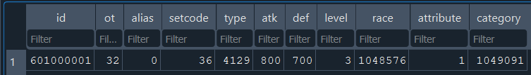
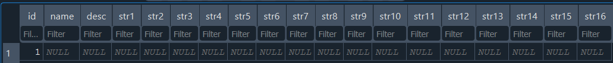

---
prev:
  text: Your First Card
  link: '../first-card'
---

This page explains how to add a card using an SQLite editor. If you're a complete beginner, we recommend the [alternative tutorial that uses Datacorn](./adding-datacorn) instead, unless you're unable to use _Datacorn_ or you specifically want to get started with working with raw SQLite values.

Moreover, this page only covers how to add our example card, "Scrap Scholar", specifically. It does not explain certain details that are not relevant to the card. If you need a complete explanation of all the database fields to be able to add any card, refer to the comprehensive [card database guide](/guides/general/cdb).

We'll be using [DB Browser for SQLite](https://sqlitebrowser.org/dl/) on this page. You could follow along with a different SQLite editor such as [SQLiteStudio](https://sqlitestudio.pl/), provided you're already comfortable with its interface or can adapt the steps on your own. **You should already have _DB Browser_ (or your preferred editor) installed before proceeding.**

## Creating a new database

The first thing you'll need to do is create the database that will contain the new card. However, we don't actually recommend creating a new database directly in an SQLite editor. Doing so would require you to manually set up all the necessary tables and fields, which can be time-consuming and error-prone.

Instead, we recommend starting with a pre-made empty `.cdb` file. You can download one [here](/empty.cdb) (right-click the link and select `Save Link As...`).

::: tip

Another common way to create an empty card database is to start with an existing one, such as one of the default `.cdb` files used by _EDOPro_. You can make a copy of it then clear the contents of the copy to have an effectively "new" database.

:::

Place the empty `.cdb` file inside the `expansions` folder of your local _EDOPro_ folder.

For example, if your local _EDOPro_ folder is `C:\ProjectIgnis` (the default installation folder if you use the installer), then you need to place the `.cdb` file in `C:\ProjectIgnis\expansions`.

Your `expansions` folder should then include the new database, alongside the default ones:

In this example, we've also renamed the file into `my-customs.cdb`. You can name the file anything you want, but make sure it has the `.cdb` extension. Its exact name won't matter as long as it's in the correct folder.

When you open the file in _DB Browser_, you should have something like this:

::: warning Can't find the database you want to open?

By default, most SQLite Editors, including _DB Browser_, will only include files with standard SQLite extensions such as `.sqlite3` when you try to open a database through their file selection dialog.

Since card database files have a non-standard file extension (`.cdb`), they are excluded at first. You'll need to set the file type filter to `All files (*)` in order to see them:

:::

## Adding the card entry

With your database ready, you can now add "Scrap Scholar" to it. Here's a quick reference for the card:

::: info Scrap Scholar

Level 3 EARTH

**[ Psychic / Tuner / Effect ]**

_Once per turn: You can banish 1 card from your hand; destroy 1 other monster you control, and if you do, add 1 "Scrap" card from your Deck to your hand, except "Scrap Scholar". If this card is destroyed by the effect of a "Scrap" card and sent to your GY: You can target 1 other "Scrap" monster in your GY; Special Summon it, then destroy 1 card you control, except "Scrap Scholar". You can only use this effect of "Scrap Scholar" once per turn._

800 ATK / 700 DEF

:::

To get started, navigate to the data view of your SQLite editor. In _DB Browser_, you can do this by switching to the `Browse Data` tab:

This brings you to a screen where you can add, edit, or delete entries in a "table". Card databases have two tables, and the screen defaults to the first one, called `datas`. You should see an empty table like this:

### The `datas` table

The `datas` table stores all non-textual information for each card, such as its stats and types. **All values here must be integers.**

Begin by adding a new entry or "record" on this table. In _DB Browser_, you can do this by clicking on the "Insert" icon:

You should now have a blank entry like this:

Now you can begin filling in the fields for your new card. We'll go through what to enter in each one for "Scrap Scholar".

#### id

This field defines the card's passcode. Set it to `601000001` (or whatever passcode you [decided to use](../first-card#deciding-the-passcode) for the card).

#### ot

This field defines the card's scope, which determines the types of duels the card is valid in, such as "OCG", "TCG", and "Rush".

In our case, the card's scope is **Custom** since it's a custom card. However, you can't simply type `Custom` into the field, as it only accepts a numerical value. Instead, you'll need to enter the corresponding number for the **Custom** scope. You can expand the following table to show the values for each scope:

::: details Table of scope values

| Scope       | HEX      | DEC    |
| ----------- | -------- | ------ |
| OCG         | `0x1`    | `1`    |
| TCG         | `0x2`    | `2`    |
| Anime       | `0x4`    | `4`    |
| Illegal     | `0x8`    | `8`    |
| Video Game  | `0x10`   | `16`   |
| Custom      | `0x20`   | `32`   |
| Speed       | `0x40`   | `64`   |
| Pre-Release | `0x100`  | `256`  |
| Rush        | `0x200`  | `512`  |
| Legend      | `0x400`  | `1024` |
| Hidden      | `0x1000` | `4096` |

:::

Looking up the value for **Custom**, we get `32`.

::: warning

Be sure to enter the **decimal** value (`32`), not the hexadecimal one (`0x20`). The hexadecimal values are only included in the table as reference for advanced users.

:::

#### alias

This field defines another passcode the card is treated as. This is not applicable for our card, so set it to `0`.

#### setcode

This field defines the card's archetype(s). Our card is part of the "Scrap" archetype, but once again, you can't simply enter `Scrap` into the field.

[This page](/api/enums/Archetype) lists all the official archetypes in the game and their corresponding values, usually called their "setcode". The value for "Scrap" is `36`.

#### type

This field defines the card's type(s). Our card is an **Effect Monster**, as well as a **Tuner**.

[This page](/api/enums/CardType) lists all the card types in the game and their corresponding values. For cards with multiple types, you need to **add the values together** to get the final number to enter.

For "Scrap Scholar", we need to add the values for **Monster**, **Effect**, and **Tuner**:

| Type      | HEX      | DEC    |
| --------- | -------- | ------ |
| Monster   | `0x1`    | `1`    |
| Effect    | `0x20`   | `32`   |
| Tuner     | `0x1000` | `4096` |
| **TOTAL** | `0x1021` | `4129` |

This means the value you need to enter is `4129`. Notice that we didn't include **Psychic**, which is the card's Monster Type, and is defined in the [race field](#race) instead.

#### atk

This field defines the card's ATK. Set it to `800`.

#### def

This field defines the card's DEF. Set it to `700`.

#### level

This field defines the card's Level. Set it to `3`.

#### race

This field defines the card's Monster Type. Our card is a **Psychic** monster.

[This page](/api/enums/MonsterRace) lists all the Monster Types in the game and their corresponding values. The value for **Psychic** is `1048576`.

#### attribute

This field defines the card's attribute. Our card is an **EARTH** monster.

[This page](/api/enums/MonsterAttribute) lists all the Monster Types in the game and their corresponding values. The value for **EARTH** is `1`.

#### category (optional)

This field defines the card's "categories". They are **optional** and do not affect how the card works in a duel. Instead, they are used to filter cards in _EDOPro_'s deck editor. If you don't feel like including them, you can set the field to `0` then [skip ahead to the summary](#summary-of-inputs).

<!--@include: ./adding-categories.md-->

Once again, you'll need to convert these categories into their corresponding values then add them since there are multiple. You can expand the following table to show the values for every possible category.

::: details Table of category values

| Category           | HEX          | DEC          |
| ------------------ | ------------ | ------------ |
| Destroy Monster    | `0x1`        | `1`          |
| Destroy S/T        | `0x2`        | `2`          |
| Destroy Deck       | `0x4`        | `4`          |
| Destroy Hand       | `0x8`        | `8`          |
| Send to GY         | `0x10`       | `16`         |
| Send to Hand       | `0x20`       | `32`         |
| Send to Deck       | `0x40`       | `64`         |
| Banish             | `0x80`       | `128`        |
| Draw               | `0x100`      | `256`        |
| Search             | `0x200`      | `512`        |
| Change ATK/DEF     | `0x400`      | `1024`       |
| Change Level/Rank  | `0x800`      | `2048`       |
| Position           | `0x1000`     | `4096`       |
| Piercing           | `0x2000`     | `8192`       |
| Direct Attack      | `0x4000`     | `16384`      |
| Multi Attack       | `0x8000`     | `32768`      |
| Negate Activation  | `0x10000`    | `65536`      |
| Negate Effect      | `0x20000`    | `131072`     |
| Damage LP          | `0x40000`    | `262144`     |
| Recover LP         | `0x80000`    | `524288`     |
| Special Summon     | `0x100000`   | `1048576`    |
| Non-effect-related | `0x200000`   | `2097152`    |
| Token-related      | `0x400000`   | `4194304`    |
| Fusion-related     | `0x800000`   | `8388608`    |
| Ritual-related     | `0x1000000`  | `16777216`   |
| Synchro-related    | `0x2000000`  | `33554432`   |
| Xyz-related        | `0x4000000`  | `67108864`   |
| Link-related       | `0x8000000`  | `134217728`  |
| Counter-related    | `0x10000000` | `268435456`  |
| Gamble             | `0x20000000` | `536870912`  |
| Control            | `0x40000000` | `1073741824` |
| Move Zones         | `0x80000000` | `2147483648` |

:::

Looking up the value for each category and adding them, we get:

| Category        | HEX        | DEC       |
| --------------- | ---------- | --------- |
| Destroy Monster | `0x1`      | `1`       |
| Destroy S/T     | `0x2`      | `2`       |
| Search          | `0x200`    | `512`     |
| Special Summon  | `0x100000` | `1048576` |
| **TOTAL**       | `0x100203` | `1049091` |

So, the value you need to enter is `1049091`.

#### Summary of `datas` inputs

Once you have entered all those values, the table should now look like this:

Or like this if you included the categories:

This card is not yet valid, as we still have another table to fill up. **Save your changes before we move to the next step**. In _DB Browser_, you can save by pressing `Ctrl+S`.

### The `texts` table

As mentioned earlier, card databases contain two tables. The second table is called `texts` and contains textual information about the card.

In _DB Browser_, you can switch the current table through a drop-down menu:

After switching to `texts`, you'll once again see an empty table since we haven't added anything in this table yet. Just like with `datas`, click on the "Insert" icon to create a new entry, which should look like this:

#### id

This field should be set to the same value you entered in [the id field of the `datas` table earlier](#id). **It's very important that they match**, since it's what links the two entries in the two tables together.

#### name

This field defines the card's name. Set it to `Scrap Scholar`.

#### desc

This field defines the card text, or the card's "description". Set it to the following:

> Once per turn: You can banish 1 card from your hand; destroy 1 other monster you control, and if you do, add 1 "Scrap" card from your Deck to your hand, except "Scrap Scholar". If this card is destroyed by the effect of a "Scrap" card and sent to your GY: You can target 1 other "Scrap" monster in your GY; Special Summon it, then destroy 1 card you control, except "Scrap Scholar". You can only use this effect of "Scrap Scholar" once per turn.

#### str1 to str16

After **desc**, you'll see a series of fields labeled **str1**, **str2**, and so on. These fields define various strings that the card will use. This will make sense once we are scripting and testing the card, so we'll **leave them empty for now**.

#### Summary of `texts` inputs

Once you have entered all those values, the table should now look like this:

**Once again, make sure to save your changes.**

<!--@include: ./adding-commons.md-->
